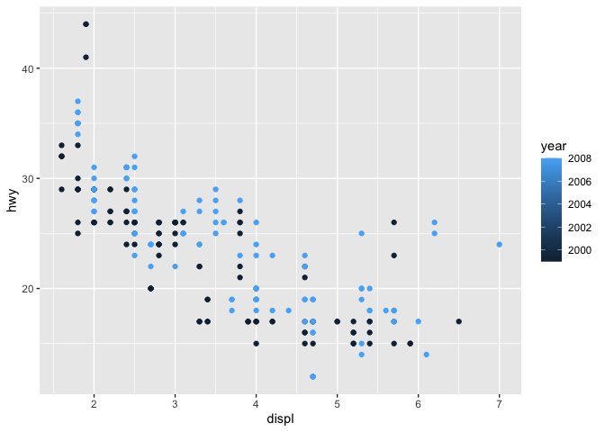
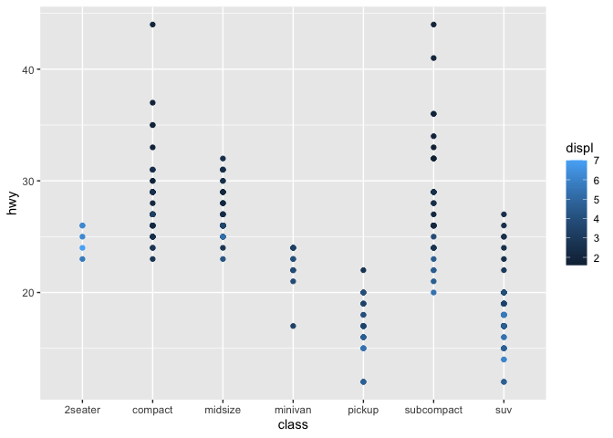

```r
library(tidyverse)
```

```
## ── Attaching packages ─────────────────────────────────────── tidyverse 1.3.0 ──
```

```
## ✓ ggplot2 3.3.0     ✓ purrr   0.3.3
## ✓ tibble  2.1.3     ✓ dplyr   0.8.5
## ✓ tidyr   1.0.2     ✓ stringr 1.4.0
## ✓ readr   1.3.1     ✓ forcats 0.5.0
```

```
## ── Conflicts ────────────────────────────────────────── tidyverse_conflicts() ──
## x dplyr::filter() masks stats::filter()
## x dplyr::lag()    masks stats::lag()
```

```r
ggplot(data = mpg) + 
  geom_point(mapping = aes(x = displ, y = hwy, color = year))
```

<!-- -->

```r
ggplot(data = mpg) + 
  geom_point(mapping = aes(x = class, y = hwy, color = displ))
```

<!-- -->
